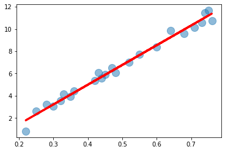

# Basic linear regression

Test using sklearn for a simple linear regression.

## Results

The full set of data:  


The split between training and test:  


The model fit:  


```py
# Predict single value
loaded_model.predict(np.array([[0.8]]))
# results
array([12.09436687])
```

## Inference API

For scoring we can use MLFlow to register experiments, register experiments against a model, and manage model versions.

Then or any model you can publish it as an inference API.


Getting the structure of the input to POST to the REST API is simple if you register the model with an input_example.
